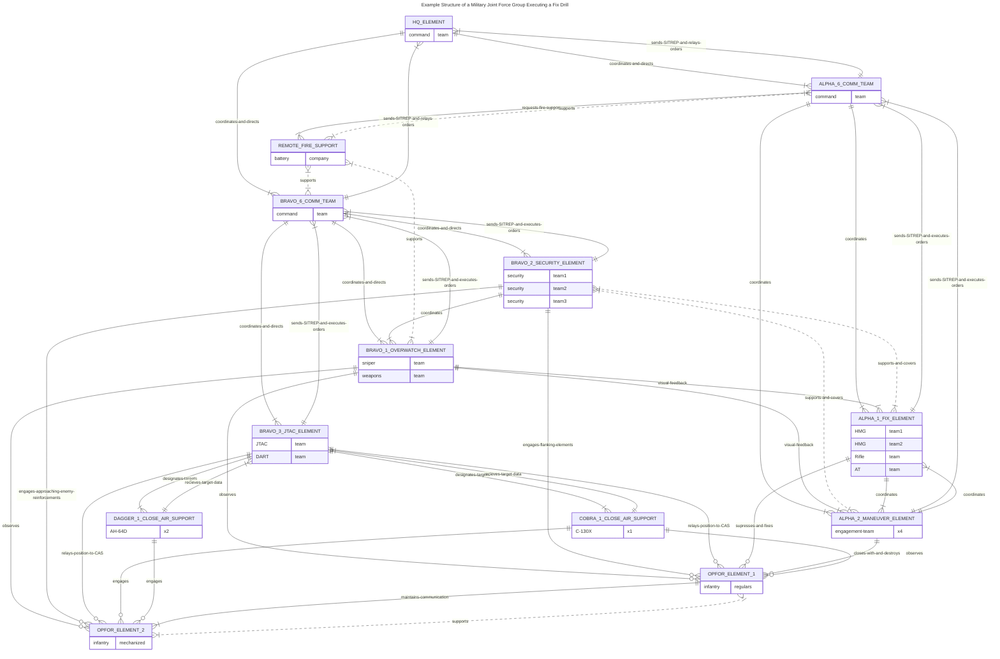

```mermaid
---
title: Example Structure of a Military Joint Force Group Executing a Fix Drill
---
erDiagram
    HQ_ELEMENT ||--|{ ALPHA_6_COMM_TEAM : coordinates-and-directs
    HQ_ELEMENT ||--|{ BRAVO_6_COMM_TEAM : coordinates-and-directs
    HQ_ELEMENT {
        command team
    } 
    ALPHA_6_COMM_TEAM ||--|{ HQ_ELEMENT : sends-SITREP-and-relays-orders
    ALPHA_6_COMM_TEAM ||--|{ ALPHA_1_FIX_ELEMENT : coordinates
    ALPHA_6_COMM_TEAM ||--|{ ALPHA_2_MANEUVER_ELEMENT : coordinates
    ALPHA_6_COMM_TEAM ||--|{ REMOTE_FIRE_SUPPORT : requests-fire-support
    ALPHA_6_COMM_TEAM {
        command team
    }    
    BRAVO_6_COMM_TEAM ||--|{ HQ_ELEMENT : sends-SITREP-and-relays-orders
    BRAVO_6_COMM_TEAM ||--|{ BRAVO_1_OVERWATCH_ELEMENT : coordinates-and-directs
    BRAVO_6_COMM_TEAM ||--|{ BRAVO_2_SECURITY_ELEMENT : coordinates-and-directs
    BRAVO_6_COMM_TEAM ||--|{ BRAVO_3_JTAC_ELEMENT : coordinates-and-directs
    BRAVO_6_COMM_TEAM {
        command team
    }   
    BRAVO_1_OVERWATCH_ELEMENT ||--|{ BRAVO_6_COMM_TEAM : sends-SITREP-and-executes-orders
    BRAVO_1_OVERWATCH_ELEMENT ||--|{ ALPHA_1_FIX_ELEMENT : visual-feedback
    BRAVO_1_OVERWATCH_ELEMENT ||--|{ ALPHA_2_MANEUVER_ELEMENT : visual-feedback
    BRAVO_1_OVERWATCH_ELEMENT ||--o{ OPFOR_ELEMENT_1 : observes
    BRAVO_1_OVERWATCH_ELEMENT ||--o{ OPFOR_ELEMENT_2 : observes
    BRAVO_1_OVERWATCH_ELEMENT {
        sniper team
        weapons team
    }
    BRAVO_2_SECURITY_ELEMENT ||--|{ BRAVO_6_COMM_TEAM : sends-SITREP-and-executes-orders
    BRAVO_2_SECURITY_ELEMENT ||--|{ BRAVO_1_OVERWATCH_ELEMENT : coordinates
    BRAVO_2_SECURITY_ELEMENT }|..|{ ALPHA_1_FIX_ELEMENT : supports-and-covers
    BRAVO_2_SECURITY_ELEMENT }|..|{ ALPHA_2_MANEUVER_ELEMENT : supports-and-covers
    BRAVO_2_SECURITY_ELEMENT ||--o{ OPFOR_ELEMENT_1 : engages-flanking-elements
    BRAVO_2_SECURITY_ELEMENT ||--o{ OPFOR_ELEMENT_2 : engages-approaching-enemy-reinforcements 
    BRAVO_2_SECURITY_ELEMENT {
        security team1 
        security team2 
        security team3  
    }
    BRAVO_3_JTAC_ELEMENT ||--|{ BRAVO_6_COMM_TEAM : sends-SITREP-and-executes-orders
    BRAVO_3_JTAC_ELEMENT ||--|{ COBRA_1_CLOSE_AIR_SUPPORT : designates-targets
    BRAVO_3_JTAC_ELEMENT ||--|{ DAGGER_1_CLOSE_AIR_SUPPORT : designates-targets
    BRAVO_3_JTAC_ELEMENT ||--o{ OPFOR_ELEMENT_1 : relays-position-to-CAS
    BRAVO_3_JTAC_ELEMENT ||--o{ OPFOR_ELEMENT_2 : relays-position-to-CAS
    BRAVO_3_JTAC_ELEMENT {
        JTAC team
        DART team
    }    
    ALPHA_1_FIX_ELEMENT ||--|{ ALPHA_6_COMM_TEAM : sends-SITREP-and-executes-orders
    ALPHA_1_FIX_ELEMENT ||--|{ ALPHA_2_MANEUVER_ELEMENT : coordinates  
    ALPHA_1_FIX_ELEMENT ||--o{ OPFOR_ELEMENT_1 : supresses-and-fixes
    ALPHA_1_FIX_ELEMENT {
        HMG team1
        HMG team2
        Rifle team
        AT team
    }
    ALPHA_2_MANEUVER_ELEMENT ||--|{ ALPHA_6_COMM_TEAM : sends-SITREP-and-executes-orders
    ALPHA_2_MANEUVER_ELEMENT ||--|{ ALPHA_1_FIX_ELEMENT : coordinates 
    ALPHA_2_MANEUVER_ELEMENT ||--o{ OPFOR_ELEMENT_1 : closes-with-and-destroys
    ALPHA_2_MANEUVER_ELEMENT {
        engagement-team x4
    }    
    COBRA_1_CLOSE_AIR_SUPPORT ||--|{ BRAVO_3_JTAC_ELEMENT : recieves-target-data
    COBRA_1_CLOSE_AIR_SUPPORT ||--o{ OPFOR_ELEMENT_1 : observes
    COBRA_1_CLOSE_AIR_SUPPORT ||--o{ OPFOR_ELEMENT_2 : engages
    COBRA_1_CLOSE_AIR_SUPPORT {
        C-130X x1
    }
    DAGGER_1_CLOSE_AIR_SUPPORT ||--|{ BRAVO_3_JTAC_ELEMENT : recieves-target-data
    DAGGER_1_CLOSE_AIR_SUPPORT ||--o{ OPFOR_ELEMENT_2 : engages
    DAGGER_1_CLOSE_AIR_SUPPORT {
        AH-64D x2 
    }    
    REMOTE_FIRE_SUPPORT }|..|{ ALPHA_6_COMM_TEAM : supports
    REMOTE_FIRE_SUPPORT }|..|{ BRAVO_6_COMM_TEAM : supports
    REMOTE_FIRE_SUPPORT }|..|{ BRAVO_1_OVERWATCH_ELEMENT : supports
    REMOTE_FIRE_SUPPORT {
        battery company
    }
    OPFOR_ELEMENT_1 ||--|{ OPFOR_ELEMENT_2 : maintains-communication
    OPFOR_ELEMENT_1 {
        infantry regulars
    }
    OPFOR_ELEMENT_2 }|..|{ OPFOR_ELEMENT_1 : supports 
    OPFOR_ELEMENT_2 {
        infantry mechanized
    }    
```

    
    
